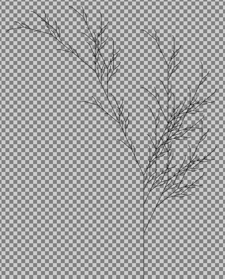

<div align="center">
  <h1>🌿 Generador de Fractales (L-Systems)</h1>

  <p>
    <strong>Paradigmas de Programación</strong><br>
    Un intérprete de Sistemas de Lindenmayer (L-Systems) desarrollado en Clojure.<br>
    Genera gráficos vectoriales (SVG) a partir de reglas gramaticales recursivas.
  </p>

  
  
  

  <br><br>

  
</div>

---

## 📋 Descripción
Este proyecto implementa un parser e intérprete de **Sistemas-L** utilizando el paradigma funcional. El programa lee definiciones de fractales (axiomas y reglas de reescritura) desde archivos de texto, expande las reglas según un número de iteraciones y utiliza "Turtle Graphics" para dibujar el resultado en un archivo **SVG**.

---

## ⚙️ Requerimientos

Para ejecutar este proyecto necesitas tener instalado en tu sistema:
* **Java JDK 17** (o superior).
* **Leiningen** (Gestor de proyectos para Clojure).

---

## 🚀 Instalación y Ejecución (Linux/Ubuntu)

Si estás utilizando Ubuntu, sigue estos pasos en tu terminal para configurar el entorno y correr el juego:

### 1. Instalar dependencias
```bash
sudo apt update
sudo apt install openjdk-17-jdk leiningen
```

### 2. Clonar el repositorio
```bash
git clone git@github.com:FIUBA-LAXI/svg-generator.git
cd svg-generator
```

### 3. Ejecutar el generador

El programa se ejecuta desde la consola y requiere 3 argumentos obligatorios.

#### **Sintaxis:**

```bash
lein run <archivo_entrada.sl> <iteraciones> <archivo_salida.svg>
```

#### **Ejemplo de uso (Curva de Koch):**

```bash
lein run resources/ejemplos-sistemas-l/koch1.sl 4 resultado.svg
```

## 💻 Argumentos del programa

| Argumento | Tipo | Descripción | Ejemplo |
| :---: | :---: | :---: | :--- |
| Input | Ruta | Archivo .sl con la definición del sistema L. | resources/dragon.sl |
| Iteraciones | Entero | Nivel de profundidad/detalle de la recursión. | 10 | 
| Output | Ruta | Nombre del archivo de imagen vectorial a generar. | salida.svg |

## 📝 Formato de Archivos .sl

Los archivos de entrada definen la gramática del fractal y deben seguir estrictamente la siguiente estructura de líneas:

1. Ángulos: Uno o dos números decimales (grados).

    * Si hay uno: Se usa para rotación izquierda y derecha.

    * Si hay dos: El primero es para izquierda, el segundo para derecha.

2. Axioma: Cadena inicial de caracteres.

3. Reglas: Reglas de reescritura en formato CARACTER REEMPLAZO (separadas por espacio).

**Ejemplo de archivo (planta.sl):**

```Plaintext
25.7            <-- Ángulo de rotación (25.7 grados)
X               <-- Axioma inicial
X F[+X][-X]FX   <-- Regla para X
F FF            <-- Regla para F
```

## 🐢 Comandos de la Tortuga

El intérprete soporta los siguientes comandos para dibujar y controlar la tortuga:

### 🎨 Movimiento y Dibujo

| Tecla |	Acción |
| :---: | :--- |
|<kbd>F</kbd> / <kbd>G</kbd> |	Avanza y dibuja una línea. |
|<kbd>f</kbd> / <kbd>g</kbd> |	Avanza sin dibujar (movimiento invisible). |
|<kbd>C</kbd>	| Dibuja un Círculo en la posición actual. |
|<kbd>R</kbd>	| Dibuja un Cuadrado (Rectángulo) rotado según el ángulo actual. |

### 🔄 Rotación y Memoria
| Tecla |	Acción |
| :---: | :--- |
|<kbd>+</kbd> |	Gira a la derecha (según el ángulo definido).
|<kbd>-</kbd> |	Gira a la izquierda (según el ángulo definido).
|<kbd> |	</|kbd>
|<kbd>[</kbd> |	Guarda el estado actual (posición, ángulo, color, grosor) en la pila.
|<kbd>]</kbd> |	Recupera el último estado guardado de la pila.

### 🖌️ Estilos (Color y Grosor)

El estilo se mantiene hasta que se cambie o se restaure un estado con ].

| Caracter |	Color |	Caracter |	Color |
| :---: | :---: | :---: | :--- |
|<kbd>a</kbd> |	🔵 Blue |	<kbd>k</kbd> |	⚫ Black |
|<kbd>b</kbd> |	🔴 Red |	<kbd>l</kbd> |	⚪ Gray |
|<kbd>c</kbd> |	🟢 Green |	<kbd>m</kbd> |	🍏 Lime |
|<kbd>d</kbd> |	🟡 Yellow |	<kbd>n</kbd> |	🔵 Navy |
|<kbd>e</kbd> |	🟣 Purple |	<kbd>o</kbd> |	🫒 Olive |
|<kbd>h</kbd> |	🟤 Brown |	<kbd>p</kbd> |	🌸 Pink |
|<kbd>i</kbd> |	🟦 Cyan |	<kbd>q</kbd> |	🟠 Orange |
|<kbd>j</kbd> |	🟣 Magenta |

Grosor del trazo: De <kbd>0</kbd> (invisible) a <kbd>9</kbd> (muy grueso).

## 👥 Integrantes

| Integrante | Padrón | Contacto |
| :--- | :---: | :---: |
| **Calderón Vasil, Máximo Augusto** | 111810 | [](https://github.com/maxivasil) [](mailto:mcalderonv@fi.uba.ar) |
| **Ienco, Lara Eliana** | 111921 | [](https://github.com/Lara-Ienco) [](mailto:lienco@fi.uba.ar) |

<div align="center"> <p>Facultad de Ingeniería de la Universidad de Buenos Aires (FIUBA)</p> </div>